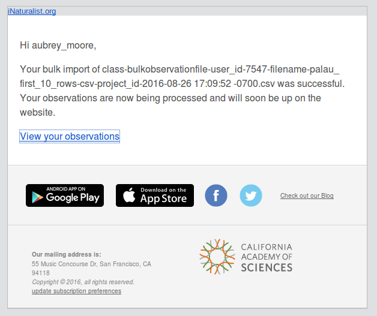
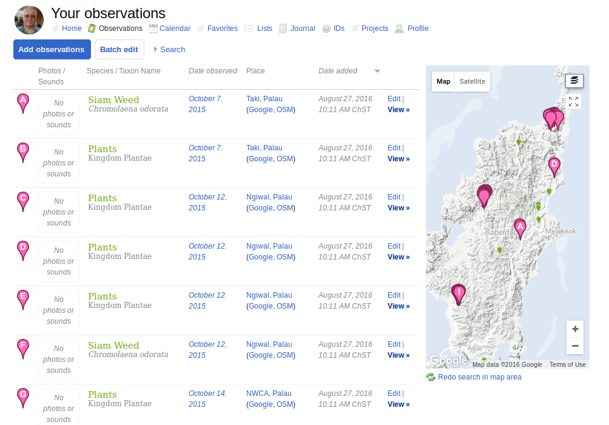
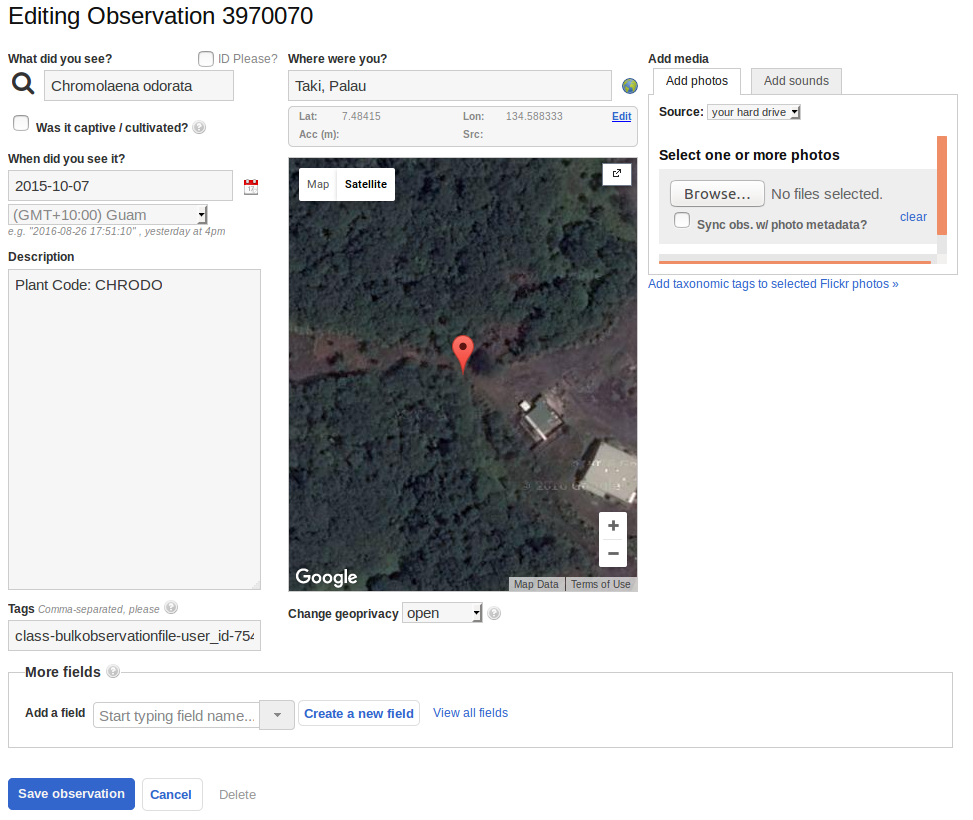
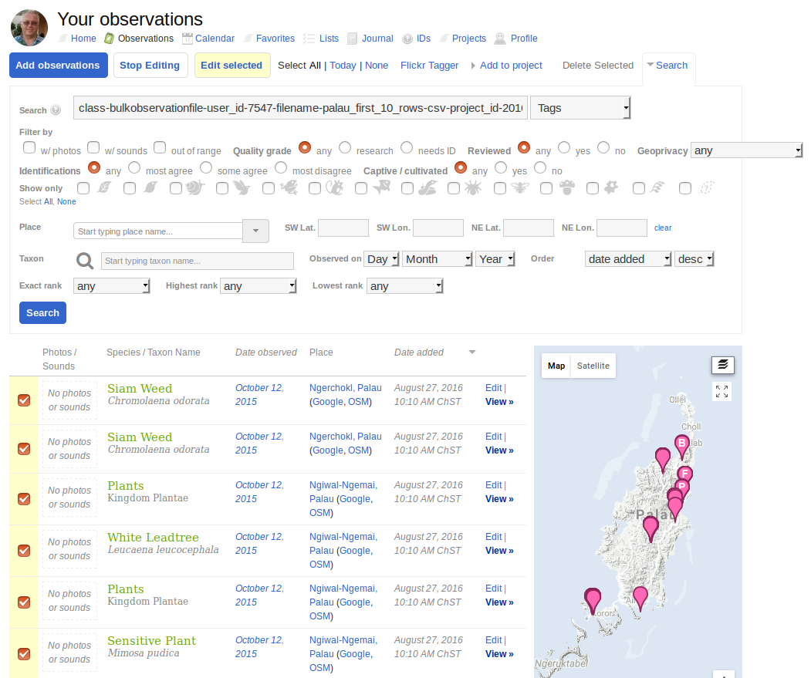

# Extracting Data from Excel Spreadsheets into a CSV for Upload to iNaturalist 
Dr. Joel Miles, Palau Invasive Species Coordinator, has been storing data from a Palau Invasive Plant survey as spreadsheets in an Excel Workbook. 
As a technical challenge, I wrote this iPython notebook to wrangle the data into a CSV for ingestion by iNaturalist.


```python
import pandas as pd
pd.set_option("display.max_rows",4)
```

### Grab the fields we want from each spreadsheet and store in a dataframe


```python
df = pd.DataFrame(columns=['Place name', 'Plant Code', 'Longitude', 'Latitude'])

xls = pd.ExcelFile('PAN Workbook for Data Management v4.xlsx')
for sheet_name in xls.sheet_names:
    df1 = xls.parse(sheet_name, header=1)
    df1 = df1[['Date', 'Plant Code', 'Longitude', 'Latitude']]
    df1['Place name'] = '{}, Palau'.format(sheet_name)
    df = df.append(df1, ignore_index=True)
df
```


<div>
<table border="1" class="dataframe">
  <thead>
    <tr style="text-align: right;">
      <th></th>
      <th>Date</th>
      <th>Latitude</th>
      <th>Longitude</th>
      <th>Place name</th>
      <th>Plant Code</th>
    </tr>
  </thead>
  <tbody>
    <tr>
      <th>0</th>
      <td>2015-10-14 00:00:00</td>
      <td>134 33.063</td>
      <td>7 20.439</td>
      <td>Airai, Palau</td>
      <td>None</td>
    </tr>
    <tr>
      <th>1</th>
      <td>2015-10-14 00:00:00</td>
      <td>134 33.938</td>
      <td>7 20.501</td>
      <td>Airai, Palau</td>
      <td>None</td>
    </tr>
    <tr>
      <th>...</th>
      <td>...</td>
      <td>...</td>
      <td>...</td>
      <td>...</td>
      <td>...</td>
    </tr>
    <tr>
      <th>393</th>
      <td>2015-10-07 00:00:00</td>
      <td>134 35.23</td>
      <td>7 29.2</td>
      <td>Taki, Palau</td>
      <td>AruGra</td>
    </tr>
    <tr>
      <th>394</th>
      <td>2015-10-07 00:00:00</td>
      <td>134 35.30</td>
      <td>7 29.049</td>
      <td>Taki, Palau</td>
      <td>ChrOdo</td>
    </tr>
  </tbody>
</table>
<p>395 rows × 5 columns</p>
</div>


### Remove unnecessary rows (those without a Plant Code)


```python
df = df[pd.notnull(df['Plant Code'])] # Remove rows where Plant Code is blank (null)
df = df[df['Plant Code'] != 'None']   # Remove rows where Plant Code is 'None'
#df
```

### Remove rows with bad data


```python
df.dropna(inplace=True)                       # Delete rows where any field is empty
#df
```

### Swap column headers for Latitude and Longitude
The columns for latitude and longitude are mislabeled in the original spreadsheet,


```python
df = df.rename(columns = {'Longitude': 'x'})
df = df.rename(columns = {'Latitude': 'Longitude'})
df = df.rename(columns = {'x': 'Latitude'})
#df
```

### Convert GPS coordinates to decimal degrees


```python
def decimal_degrees(s):
    splt = s.split()
    degrees = int(splt[0])
    minutes = float(splt[1])
    return degrees + minutes / 60.0

for index, row in df.iterrows():
    dd_longitude = decimal_degrees(row['Longitude'])
    df.set_value(index, 'Longitude', dd_longitude)
    dd_latitude = decimal_degrees(row['Latitude'])
    df.set_value(index, 'Latitude', dd_latitude)
```

### Convert plant codes to upper case and list unique values


```python
df['Plant Code'] = df['Plant Code'].str.upper()
sorted(df['Plant Code'].unique())
```


    ['ACAAUR',
     'ADEPAV',
     'ALLCAT',
     'ARUDON',
     'ARUGRA',
     'BIDALB',
     'BOUNDARY',
     'CENPOL',
     'CENPUR',
     'CHANIC',
     'CHRODO',
     'CLIHIR',
     'DESINC',
     'DIESEG',
     'EPIPIN',
     'FALMOL',
     'HYPCAP',
     'IMPCON',
     'LANCAM',
     'LEULEU',
     'MACATR',
     'MEGMAX',
     'MIKMIC',
     'MIMPUD',
     'MUNCAL',
     'NENENG',
     "NENENG'S UNCLE",
     'RATS TAIL',
     'RATTAN',
     'SACSPO',
     'SESCAN',
     'SORHAL',
     'SPHTRI',
     'STACAY',
     'STAJAM',
     'SURATO',
     'THUGRA',
     'TRASPA',
     'TURSUB',
     'UNKNOWN']


### Replace Plant Code with scientific name
We create a dictionary taxon names keyed by olant code. We then use this dictionary to add a **Taxon name** column. Note that I have guessed a few taxon names, but left most as Plantae.


```python
dict = {'ACAAUR': 'Acacia auriculiformis', 
        'ADEPAV': 'Plantae',
        'ALLCAT': 'Plantae',
        'ARUDON': 'Arundo donax',
        'ARUGRA': 'Plantae',
        'BIDALB': 'Plantae',
        'BOUNDARY': 'Plantae',
        'CENPOL': 'Plantae',
        'CENPUR': 'Plantae',
        'CHANIC': 'Plantae',
        'CHRODO': 'Chromolaena odorata',
        'CLIHIR': 'Plantae',
        'DESINC': 'Plantae',
        'DIESEG': 'Plantae',
        'EPIPIN': 'Plantae',
        'FALMOL': 'Plantae',
        'HYPCAP': 'Plantae',
        'IMPCON': 'Imperata conferta',
        'LANCAM': 'Plantae',
        'LEULEU': 'Leucaena leucocephala',
        'MACATR': 'Plantae',
        'MEGMAX': 'Plantae',
        'MIKMIC': 'Plantae',
        'MIMPUD': 'Mimosa pudica',
        'MUNCAL': 'Plantae',
        'NENENG': 'Plantae',
        "NENENG'S UNCLE": 'Plantae',
        'RATS TAIL': 'Plantae',
        'RATTAN': 'Plantae',
        'SACSPO': 'Plantae',
        'SESCAN': 'Plantae',
        'SORHAL': 'Plantae',
        'SPHTRI': 'Plantae',
        'STACAY': 'Plantae',
        'STAJAM': 'Plantae',
        'SURATO': 'Plantae',
        'THUGRA': 'Plantae',
        'TRASPA': 'Plantae',
        'TURSUB': 'Plantae',
        'UNKNOWN': 'Plantae'
        }

df['Taxon name']  = ''  # Create a new column and populate using dictionary  
for index, row in df.iterrows():
    df.set_value(index, 'Taxon name', dict[row['Plant Code']])    
```


```python
df
```


<div>
<table border="1" class="dataframe">
  <thead>
    <tr style="text-align: right;">
      <th></th>
      <th>Date</th>
      <th>Longitude</th>
      <th>Latitude</th>
      <th>Place name</th>
      <th>Plant Code</th>
      <th>Taxon name</th>
    </tr>
  </thead>
  <tbody>
    <tr>
      <th>6</th>
      <td>2015-10-14 00:00:00</td>
      <td>134.547</td>
      <td>7.34175</td>
      <td>Airai, Palau</td>
      <td>ACAAUR</td>
      <td>Acacia auriculiformis</td>
    </tr>
    <tr>
      <th>15</th>
      <td>2015-10-09 00:00:00</td>
      <td>134.46</td>
      <td>7.33833</td>
      <td>Long Island, Palau</td>
      <td>MIKMIC</td>
      <td>Plantae</td>
    </tr>
    <tr>
      <th>...</th>
      <td>...</td>
      <td>...</td>
      <td>...</td>
      <td>...</td>
      <td>...</td>
      <td>...</td>
    </tr>
    <tr>
      <th>393</th>
      <td>2015-10-07 00:00:00</td>
      <td>134.587</td>
      <td>7.48667</td>
      <td>Taki, Palau</td>
      <td>ARUGRA</td>
      <td>Plantae</td>
    </tr>
    <tr>
      <th>394</th>
      <td>2015-10-07 00:00:00</td>
      <td>134.588</td>
      <td>7.48415</td>
      <td>Taki, Palau</td>
      <td>CHRODO</td>
      <td>Chromolaena odorata</td>
    </tr>
  </tbody>
</table>
<p>180 rows × 6 columns</p>
</div>


### Build CSV string


```python
# Header row
s = ''
s += 'Taxon name,Date observed,Description,Place name,'
s += 'Latitude / y coord / northing,Longitude / x coord / easting,'
s += 'Tags,Geoprivacy\n'

# Data rows
for index, row in df.iterrows():
        s += '{},{:%Y-%m-%d},"Plant Code: {}","{}",{:f},{:f},,,\n'.format(
            row['Taxon name'], 
            row['Date'],
            row['Plant Code'], # Description: store Plant Code and any other data here. 
            row['Place name'],
            row['Latitude'], 
            row['Longitude'])
#print(s)
```

### Write CSV string to a file 


```python
with open("Palau.csv", "w") as text_file:
    text_file.write(s)
```

### Check CSV file by reading it back as a Pandas data frame


```python
df_csv = pd.read_csv("Palau.csv", index_col=False)
df_csv
```


<div>
<table border="1" class="dataframe">
  <thead>
    <tr style="text-align: right;">
      <th></th>
      <th>Taxon name</th>
      <th>Date observed</th>
      <th>Description</th>
      <th>Place name</th>
      <th>Latitude / y coord / northing</th>
      <th>Longitude / x coord / easting</th>
      <th>Tags</th>
      <th>Geoprivacy</th>
    </tr>
  </thead>
  <tbody>
    <tr>
      <th>0</th>
      <td>Acacia auriculiformis</td>
      <td>2015-10-14</td>
      <td>Plant Code: ACAAUR</td>
      <td>Airai, Palau</td>
      <td>7.341750</td>
      <td>134.546883</td>
      <td>NaN</td>
      <td>NaN</td>
    </tr>
    <tr>
      <th>1</th>
      <td>Plantae</td>
      <td>2015-10-09</td>
      <td>Plant Code: MIKMIC</td>
      <td>Long Island, Palau</td>
      <td>7.338333</td>
      <td>134.460467</td>
      <td>NaN</td>
      <td>NaN</td>
    </tr>
    <tr>
      <th>...</th>
      <td>...</td>
      <td>...</td>
      <td>...</td>
      <td>...</td>
      <td>...</td>
      <td>...</td>
      <td>...</td>
      <td>...</td>
    </tr>
    <tr>
      <th>178</th>
      <td>Plantae</td>
      <td>2015-10-07</td>
      <td>Plant Code: ARUGRA</td>
      <td>Taki, Palau</td>
      <td>7.486667</td>
      <td>134.587167</td>
      <td>NaN</td>
      <td>NaN</td>
    </tr>
    <tr>
      <th>179</th>
      <td>Chromolaena odorata</td>
      <td>2015-10-07</td>
      <td>Plant Code: CHRODO</td>
      <td>Taki, Palau</td>
      <td>7.484150</td>
      <td>134.588333</td>
      <td>NaN</td>
      <td>NaN</td>
    </tr>
  </tbody>
</table>
<p>180 rows × 8 columns</p>
</div>


### Write the first ten rows to a CSV for test upload,


```python
df_csv = df_csv.head(10)
with open("Palau_first_10_rows.csv", "w") as text_file:
    text_file.write(s)
```

### Results of Test Upload

#### ------------------------------------------------------------------------------------------------------------------------------------------------------------------------------------
#### Within a few minutes after uploading the test CSV, I got an email message from iNaturalist
If the upload fails, the email will let you know what needs to be fixed.
#### ------------------------------------------------------------------------------------------------------------------------------------------------------------------------------------        



#### ------------------------------------------------------------------------------------------------------------------------------------------------------------------------------------
#### And here's what was diplayed when I clicked on the "View your observations" link:
#### ------------------------------------------------------------------------------------------------------------------------------------------------------------------------------------



#### ------------------------------------------------------------------------------------------------------------------------------------------------------------------------------------
#### Note: If you scroll to the bottom of the screen, links are provided to downlad data as a CSV (spreadsheet) or KML (Google Earth/Maps).
#### ------------------------------------------------------------------------------------------------------------------------------------------------------------------------------------


#### ------------------------------------------------------------------------------------------------------------------------------------------------------------------------------------
#### Here's the edit screen for one of the uploaded observations
Note that a tag is provided to identify uploaded observations.
#### ------------------------------------------------------------------------------------------------------------------------------------------------------------------------------------



#### ------------------------------------------------------------------------------------------------------------------------------------------------------------------------------------
#### Clean Up: Deleting observations added to iNaturalist during our test
To delete observations added during the upload test:
* Search for observations using the tag provided by the uploader
* Select all 
* Delete selected

#### ------------------------------------------------------------------------------------------------------------------------------------------------------------------------------------




```python

```
